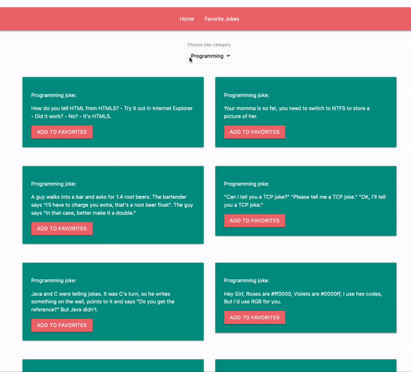

To run  this project you need to install on your computer Docker.
then go to folder Express with command `cd Express` -->  `npm install` -->  `npm run start:nodemon` -->  `docker-compose -f stack.yml up` .

Then go to Jokes folder `cd Jokes` and run `npm install` --> `npm run dev`

Here is preview: 

